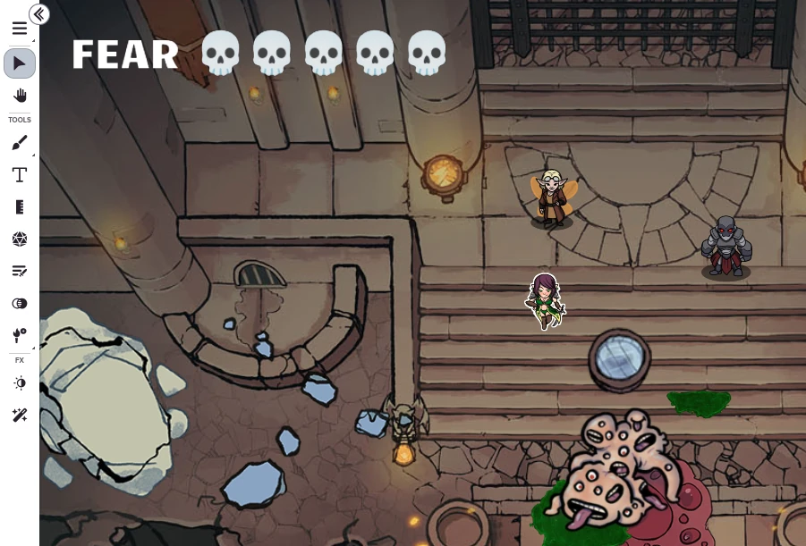

# [@orbotik](https://app.roll20.net/users/12231884/orbotik)'s Roll20 API Scripts
This repository contains my crafted scripts for Roll20 API-enabled games. They are free to use, share, and modify under
the permissive [CC-SA-BY license](LICENSE).

If you have any **ideas**, **questions**, or **problems**, *please create [an issue](https://github.com/orbotik/roll20-scripts/issues) in this repo.*

## Scripts

### [Aziz Light!](aziz-light.js)
`v1.0.0`    

This script allows you to quickly set and move the daylight brightness using dynamic lighting to different levels, making it easy to macro light levels and mimic time passing.     
*You can add an exclamation point `!` to the end of any of the commands to animate the brightness change.*

##### Commands:
| Cmd | Description |
|:-|:-|
| `!aziz light` | **GM-only.** Returns the daylight brightness to the default 90%. |
| `!aziz eve` | **GM-only.** Moves the daylight brightness to the minimum of 20%. |
| `!aziz dark` | **GM-only.** Turns daylight to 0% (off). |
| `!aziz more` | **GM-only.** Increases the daylight brightness by 5%. |
| `!aziz less` | **GM-only.** Decreases the daylight brightness by 5%. |
| `!aziz exactly [number]` | **GM-only.** Sets the daylight brightness to a specific percentage (5-100). |
> *Inspired from the scene from the Fifth Element.*    
>  

### [Cleaner](cleaner.js) 
`v1.0.0`    

This script allows you to quickly normalize and clean the HTML of a specified handout's notes (including GM notes). It removes extraneous tags and styles and basically "resets" the HTML to standard, clean tags that Roll20 doesn't have problems with.
##### Commands:
| Cmd | Description |
|:-|:-|
| `!cleaner [handout]` | Cleans the handout with the specified name (use quotes if the handout name has spaces). |

### [Daggerhear: Fear AutoTracker](daggerheart-fear.js)
`v1.0.8`    

This fear tracker listens for duality rolls from Demiplane-linked character sheets and bumps up a game fear counter everytime someone rolls with fear. It sends notices to all players showing the new fear value either as player-enabled whispers or chat announcements (or none), and can even update text objects on the maps with fear values!

Registered text objects have some creative options ("text modes", see `!fear text [...]` below) for showing the current fear amounts:

Players can turn notifications on or off as they wish, or simply run `!fear` to see the current value. As the GM, you can reset and set the fear at any time.

##### Commands:
| Cmd | Description |
|:-|:-|
| `!fear` | Reports the current fear counter value. |
| `!fear [on/off]` | Turns fear notices on or off (you only). Specifically, when a Demiplane duality roll with fear is detected, you will be sent a whisper by the game of the new fear counter value (if on). The default is `on` for all players. |
| `!fear spend [number]` | **GM-only.** Decreases the fear counter by 1, or optionally a specific number (to a minimum of 0). |
| `!fear gain [number]` | **GM-only.** Increases the fear counter by 1, or optionally a specific number (to a maximum of 12). |
| `!fear set [number]` | **GM-only.** Sets the fear to any number (0-999). |
| `!fear listen [on/off]` | **GM-only.** Turn the listener for Demiplane duality rolls on or off. This is "on" by default. |
| `!fear text {id}` | **GM-only.** Registers a text object to be updated with fear amount as it changes. The `{id}` is optional, and if omitted will set the selected text object. To stop the updating on a specific object, run the command again. |
| `!fear text prefix [text]` | **GM-only.** Specify (quoted) text to appear before the fear counter in text objects. |
| `!fear text suffix [text]` | **GM-only.** Specify (quoted) text to appear after the fear counter in text objects. |
| `!fear text [tally/circled/bar/dots/skulls/number/candles/stars/ravens]` | **GM-only.** Switches how the fear count is displayed in the text objects. |
| `!fear text update` | **GM-only.** Force the registered text objects to update with the current settings and fear value. This also lists the IDs of any registered text objects. |
| `!fear text monospace {id}` | **GM-only.** Sets the currently selected or specified (by ID) text object to use a fixed-width predictable font. |
| `!fear text spacefill [on/off]` | **GM-only.** Ensures the a uniform text length in text objects even when the fear value is low by filling unused character spots with a space. Paired with the monospace command this can help prevent the text objects from "jumping around" horizontally. |
| `!fear announce [on/off]` | **GM-only.** Globally sets announcements to *all* players on or off when the fear amount changes. |
| `!fear whispers [on/off]` | **GM-only.** Globally sets whispers to players on or off when the fear amount changes. |
| `!fear reset` | **GM-only.** Resets the fear counter to `0`. |
| `!fear reset objects` | **GM-only.** Clears all fear-tracking object registrations. |
| `!fear reset known` | **GM-only.** Clears the known player list (players will re-receive the welcome message). |

### [Switch-To](switch-to.js)
`v1.0.0`    

Ever want to tell a story as a GM and easily switch your portrait on-the-fly? This script allows you to quickly switch your "Speaking as" state to a named character in your game, revealing the portrait of that character in-game (assuming you don't have video enabled). This is really handy as an on-screen macro- you can instantly jump to "speaking as" other characters with the click of a button!

##### Commands:
| Cmd | Description |
|:-|:-|
| `!switch-to [character]` | Switches your portrait and speaking-as setting to the named character (use quotes if the character name has spaces). |
| `!switch-to @self` | Resets your portrait and speaking-as setting back to yourself. |

### [WhatIs](whatis/whatis.js)
`v1.0.0`    

This is a "*handout to searchable dictionary*" tool that converts your Roll20 handout notes into a searchable, browsable, in-game dictionary that you and your players can reference at any time. It evaluates header level 1 and 2 text and turns their content into *subjects* and *topics*. It supports topics as header-level entries or as bullet points with bolded keywords (see example).

You can even use it to announce or share specific entries with players, just in case they forget a reference. At this time, only one handout is supported at a time. See the cleaner script to help produce a usable whatis-friendly handout.    
##### Commands:
| Cmd | Description |
|:-|:-|
| `!whatis` | Show the whatis handout's intro section content. |
| `!whatis @subjects` | Show a list of all known subjects with buttons to jump to their respective topics. |
| `!whatis [subject] [topic]` | Show the contents of a specific subject and/or topic (use quotes if they have spaces). |
| `!whatis [...search terms]` | Perform a general search with one or more search terms. |
| `!whatis @search [...search terms]` | Same as above, but forces the search, even if a term directly matches a subject/topic. |
| `!whatis to@[playername] […]` | Send the results of a following `!whatis` command to the specified player. You can also specify "everyone" to send to everyone in the game, or "gm" to send to the GM of the game. |
| `!whatis @table [tablename] [# or #-#]` | Examine a rollable table and show contents, optionally specifying a specific roll at the given entry number (or range). |
| `!whatis @reload` | **GM-only.** Attempts to reload (re-parse) your whatis document. 
##### GM Recommendations
1. By default, the script looks for a handout called "WhatIs" (case-insensitive), but you can specify the ID or name in the script if desired.
2. HTML in handouts can get really messy. It's strongly recommended that you create clean content for the the handout that doesn't use special styling. The go-to procedure for effective parsing is to write your handout in markdown, then copy the rendered version into the handout notes. Once that is saved, run the `!cleaner` script on the handout to normalize it. Then you can run `!whatis @reload` to re-parse the handout. If this is done properly, you'll see your subjects listed with `!whatis @subjects`.
